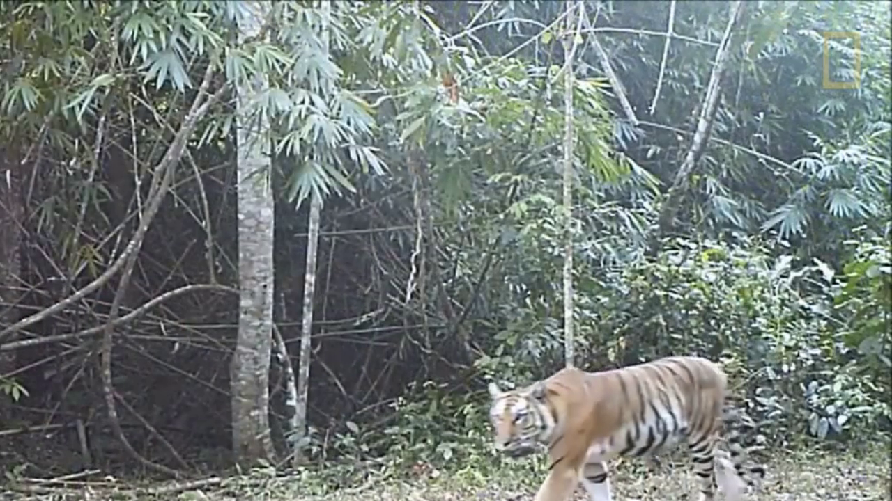
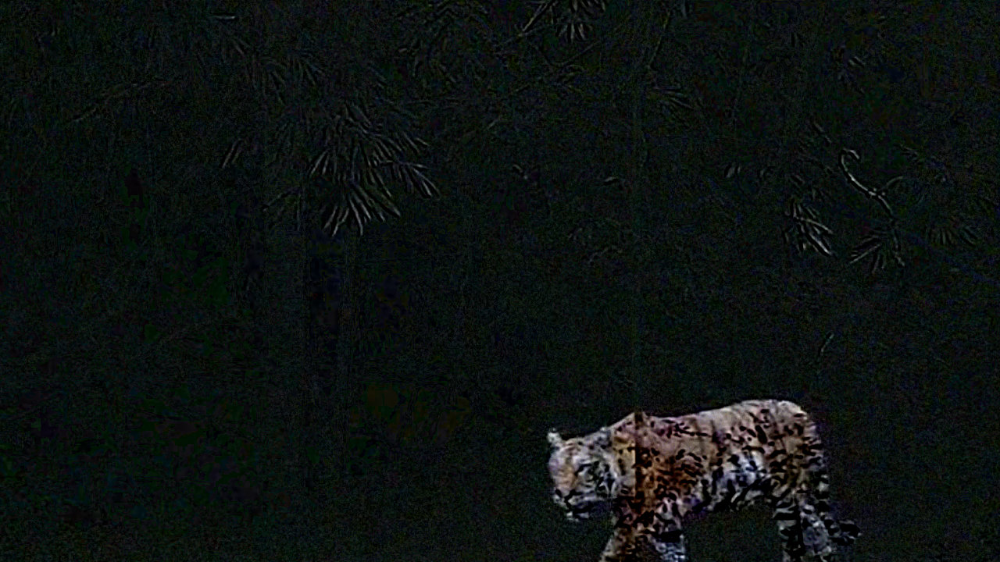
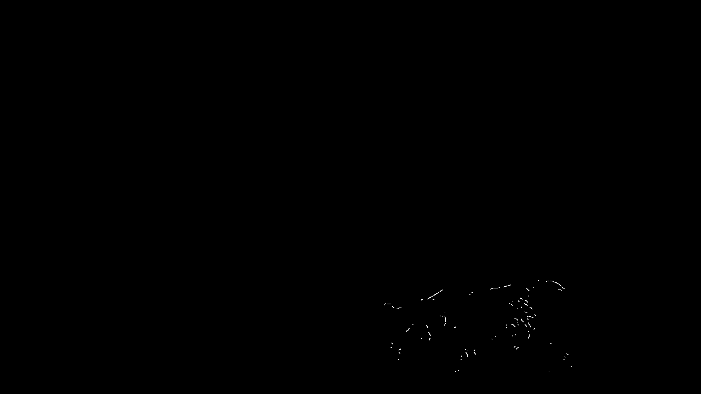
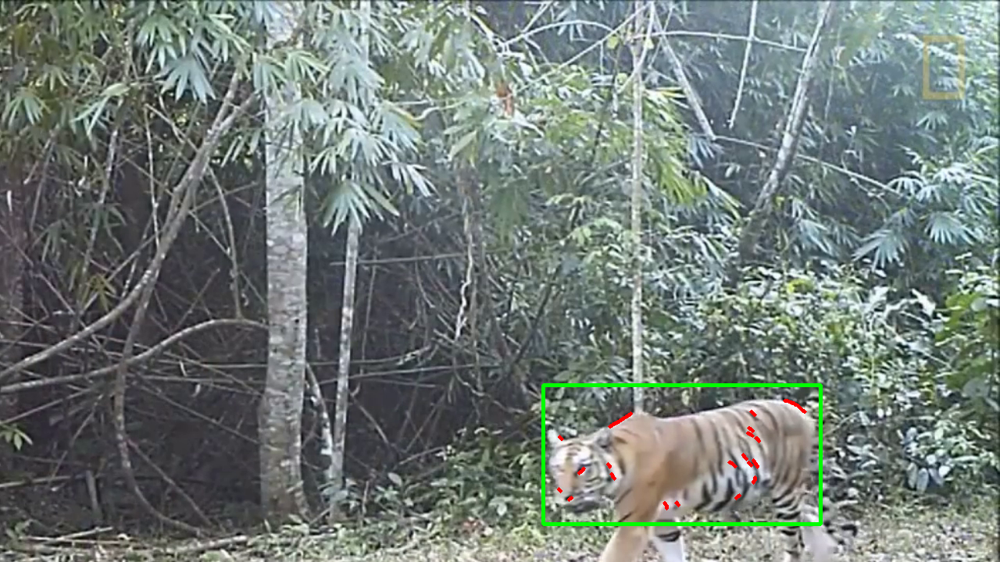
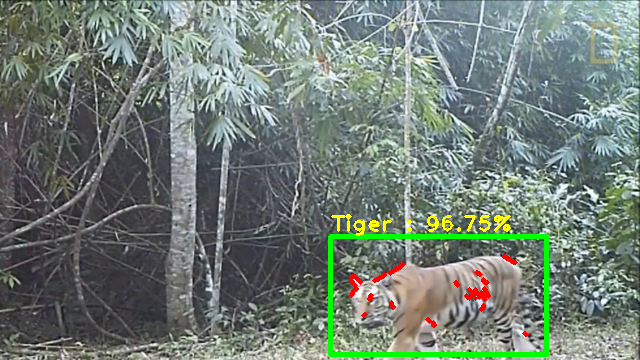

# Tiger-Detection
## By Background Subtraction, Edge Detection and Classification

### Processing Steps

 
Frame from Video Feed

 
Background Subtraction

 
Canny Edges

 
Bounding Box

 
MobileNet Classification Results

## Code Reference
* Mobile Net - https://towardsdatascience.com/transfer-learning-using-mobilenet-and-keras-c75daf7ff299